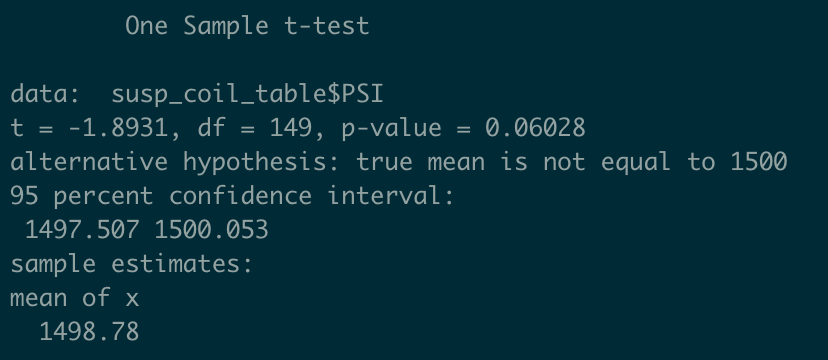
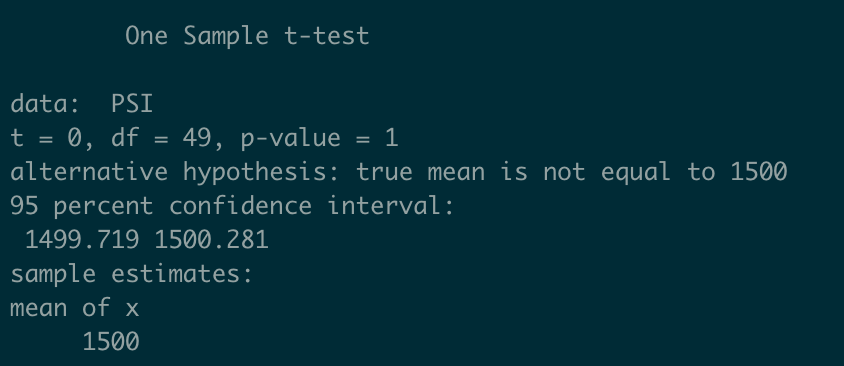

# MechaCar Statistical Analysis

## Overview

Automotive manufacuring company "'AutosRUs'" is experiencing production issues with their latest prototype, the "MechaCar". We are tasked to review the production data for insights that may help the manufacturing team to help overcome their blocked progress in the MechaCar prototype manufacturing process.

Key Objectives:
- Perform multiple linear regression analysis to identify which variables in the dataset predict the mpg of MechaCar prototypes
- Collect summary statistics on the pounds per square inch (PSI) of the suspension coils from the manufacturing lots
- Run t-tests to determine if the manufacturing lots are statistically different from the mean population
- Design a statistical study to compare vehicle performance of the MechaCar vehicles against vehicles from other manufacturers. For each statistical analysis, you’ll write a summary interpretation of the findings.

Let's dive in.

## Linear Regression to Predict MPG

Below is the output of the linear regression model, created in R, to predict the MPG variable in the MechaCar MPG dataset.

#### __Linear Regression Output__

- The following variables' coefficients provide a non-random amount of of variance to the MPG values in the dataset, as shown in our multiple linear regression model results above. These variables are statistically significant because they are below our set siginficance level of p = 0.05.
    - Intercept (p = 5.08e-08)
    - vehicle_length (p = 2.60e-12) 
    - ground_clearance (p = 5.21e-18)
- The slope of the linear model is not considered to be zero.
    - There variation in the data set, which shows that the data output is not constant (slope of zero). This is further evidenced by the results of our linear regression model showing all non-zero coefficients/slopes (under 'Estimate' column in the output displayed above) for each variable in the dataset.
- The current linear model is not sufficient to predict the MPG of MechaChar prototypes effectively.
    - While, the R-squared value (~0.71) and the Adjusted R-squared value (~0.68) are promising in indicating a decent fit of our model to explain the variability in the data, this may not be sufficient considering other factors.
    - Since our Intercept variable was considered to be statistically significant, this may mean that there are other variables not included in our data that have more significance to the MPG of the MechaCar prototypes. With this consideration our model may be overfitting predictions to the variables in the current dataset.
    - We may improve our model by iteratively selecting features for the linear model, rather than including all features for the predicition model. By doing a correlation analysis, we might discover which variables do not have a strong enough relationship to MPG and should be omitted to improve the model performance.  

## Summary Statistics on Suspension Coils

Below are tables for the summary statistics on the prototypes' suspension coils. The 'Total Summary' table represents the statistics for the dataset as a whole. The 'Lot Summary table represents the statistics for each manufacturing lot separately.

#### __Total Summary__
  

#### __Lot Summary__
  

- The design specifications for the MechaCar suspension coils dictate that the variance of the suspension coils must not exceed 100 pounds per square inch.
    - The current manufacturing data shows that this requirement is met when assessing all manufacturing lots in total.
    - The current manufacturing data shows that this requirement is met for Lots 1 & 2 individually.
        - The variance of PSI data in Lot 1 is ~0.98 PSI, as shown in the 'Lot Summary' table.
        - The variance of PSI data in Lot 2 is ~7.47 PSI, as shown in the 'Lot Summary' table.
    - The current manufacturing data shows that this requirement is __NOT__ met for __Lot 3__.
        - The variance of PSI data in Lot 3 is ~170.29 PSI, as shown in the 'Lot Summary' table. This value exceeds the 100 PSI variance limit requirement.

## T-Tests on Suspension Coils

Below are the results of t-tests performed to determine if PSI across all manufacturing lots is statistically different from the population mean, as well as if PSI for each manufacturing lot individually is statistically different from the population mean.

_population mean = 1,500 pounds per square inch (PSI)_

T-test Hypothesis:
- H0 : There __is no statistical difference__ between the observed sample mean and its presumed population mean.
- Ha : There __is a statistical difference__ between the observed sample mean and its presumed population mean.

#### __T-Test: All Lots Mean PSI vs. Population Mean PSI__
  

- The mean PSI across all manufacturing lots is 1498.78 PSI
- When performing a t-test to compare this sample mean to the population mean we get a p-value of ~0.06.
- Using a significance level of 0.05, we do not have sufficient evidence to reject the null hypothesis (H0)
- The two means tested are statistically similar for the manufacturing lots, when included together.

#### __T-Test: Lot 1 Mean PSI vs. Population Mean PSI__
  

- The mean PSI across manufacturing 'Lot 1' is 1500 PSI
- When performing a t-test to compare this sample mean to the population mean we get a p-value of 1.00.
- Using a significance level of 0.05, we do not have sufficient evidence to reject the null hypothesis (H0)
- The two means tested are statistically similar. Further, with a p-value of 1.00, we may also conclude the two means are statistically identical/equivalent for __Lot 1__.

#### __T-Test: Lot 2 Mean PSI vs. Population Mean PSI__
  

- The mean PSI across manufacturing 'Lot 2' is 1500.20 PSI
- When performing a t-test to compare this sample mean to the population mean we get a p-value of ~0.61.
- Using a significance level of 0.05, we do not have sufficient evidence to reject the null hypothesis (H0)
- The two means tested are statistically similar for __Lot 2__.

#### __T-Test: Lot 3 Mean PSI vs. Population Mean PSI__
  

- The mean PSI across manufacturing 'Lot 3' is 1496.14 PSI
- When performing a t-test to compare this sample mean to the population mean we get a p-value of ~0.04.
- Using a significance level of 0.05, we have sufficient evidence to reject the null hypothesis (H0).
- The two means tested are __NOT__ statistically similar for __Lot 3__.

## Study Design: MechaCar vs. Competition